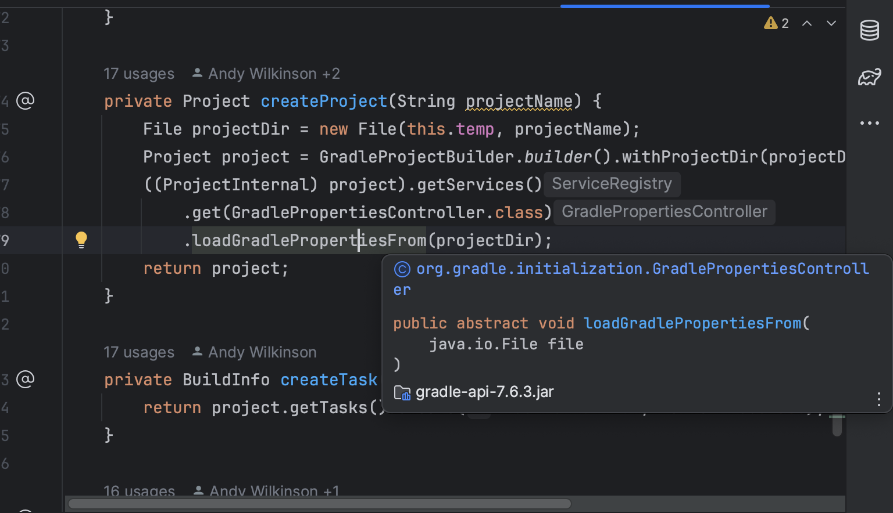

# <center> Spring Boot

---


Spring Boot is a project under the Spring Framework that simplifies developing, configuring, and deploying Spring-based applications. It promotes convention over configuration by offering pre-configured setups and auto-configuration based on project dependencies, eliminating much of the manual setup and configuration work. Spring Boot applications are stand-alone, containing an embedded web server for easy deployment as a single executable JAR. It offers opinionated defaults to reduce development effort, while still allowing for customization. Features like Actuator provide built-in endpoints for application monitoring and management. Primarily written in Java, Spring Boot supports other JVM languages like Kotlin and Groovy, making it versatile for various enterprise applications. Its goal is to enable quick application startup with less code and configuration hassle.


#### Spring is popular for its numerous advantages:

- It promotes testable code through its dependency injection method.
- Offers robust yet user-friendly database transaction management.
- Facilitates seamless integration with other Java frameworks such as JPA/Hibernate ORM and web frameworks like Struts/JSF.
- Provides a cutting-edge Web MVC framework for developing web applications.

#### Spring boot size of LOC
By using
```shell
find . -name '*.java' | xargs wc -l
```
You can easily find the specific LOC of Spring boot project
The result is `257187 total`, I also find some data come from internet about the spring boot LOC in 2020, which you can check below.
```
spring-boot-test : 13608
spring-boot-starters : 0
spring-boot-autoconfigure : 69450
spring-boot-docs : 1131
spring-boot-properties-migrator : 548
spring-boot-tools : 33627
spring-boot-cli : 10278
spring-boot-dependencies : 0
spring-boot-test-autoconfigure : 8439
spring-boot-actuator-autoconfigure : 26997
spring-boot-actuator : 27745
spring-boot-parent : 0
spring-boot-devtools : 10912
spring-boot : 61107
 
Total size of LOC：263842
```
---
## Testing

Spring Boot provides a comprehensive suite of components to facilitate testing for applications built with it. These components simplify the process of writing and executing tests by providing auto-configuration, utility classes, and annotations. Here's an overview of some of the key testing components and features offered by Spring Boot:

1. **@SpringBootTest**: This annotation is used for integration testing in Spring Boot applications. It loads the complete application context and is useful for testing the interaction between all parts of the application.

2. **@DataJpaTest**: Specifically designed for testing JPA repositories, this annotation configures an in-memory database, scans for **@Entity** classes, and configures Spring Data JPA repositories. It's ideal for data access layer testing.

3. **@WebMvcTest**: It is used for testing MVC controllers without starting a full HTTP server. It auto-configures **MockMvc** for easy testing of controller endpoints.

4. **@WebFluxTest**: Similar to **@WebMvcTest**, but for applications using Spring WebFlux. It helps in testing annotated controllers in a non-blocking way.

5. **@RestClientTest**: This annotation is useful for testing REST clients. It auto-configures **MockRestServiceServer** to mock remote REST services.

6. **@MockBean** and **@SpyBean**: Spring Boot provides these annotations for adding `Mockito` mocks or spies into the Spring application context. They can be used to replace or spy on beans in the context for unit testing.

7. **TestRestTemplate** and **WebTestClient**: For integration testing, Spring Boot offers `TestRestTemplate` for RESTful communication and `WebTestClient` for testing reactive web applications, making it easier to test web layers.

8. **JsonPath** and **XmlPath**: For testing RESTful services, Spring Boot supports JsonPath and XmlPath to query and assert the JSON or XML response content.

9. **Auto-configured Test Databases**: Spring Boot can automatically configure an in-memory database for tests, such as H2, which is very convenient for testing data access layers without the need for a real database.

10. **@TestConfiguration**: This annotation helps to define additional beans or customizations for the test context. It allows overriding of certain parts of the application configuration only for tests.

These components, among others, provide a robust framework for both unit and integration testing in Spring Boot applications, ensuring that developers can write comprehensive tests with minimal boilerplate code.


### Test cases
The spring boot project itself uses a large number of test cases to ensure that all components serve as expected. The following shows the directory structure under the spring boot test folder.
```shell
.
├── spring-boot-integration-tests
│   ├── spring-boot-configuration-processor-tests
│   ├── spring-boot-launch-script-tests
│   ├── spring-boot-loader-classic-tests
│   ├── spring-boot-loader-tests
│   └── spring-boot-server-tests
└── spring-boot-smoke-tests
    ├── spring-boot-smoke-test-activemq
    ├── spring-boot-smoke-test-actuator
    ├── spring-boot-smoke-test-actuator-custom-security
    ├── spring-boot-smoke-test-actuator-log4j2
    ├── spring-boot-smoke-test-actuator-noweb
    ├── spring-boot-smoke-test-actuator-ui
    ├── spring-boot-smoke-test-amqp
    ├── spring-boot-smoke-test-ant
    ├── spring-boot-smoke-test-aop
    ├── spring-boot-smoke-test-batch
    ├── spring-boot-smoke-test-bootstrap-registry
    ├── spring-boot-smoke-test-cache
    ├── spring-boot-smoke-test-data-cassandra
    ├── spring-boot-smoke-test-data-couchbase
    ├── spring-boot-smoke-test-data-jdbc
    ├── spring-boot-smoke-test-data-jpa
    ├── spring-boot-smoke-test-data-ldap
    ├── spring-boot-smoke-test-data-mongo
    ├── spring-boot-smoke-test-data-r2dbc
    ├── spring-boot-smoke-test-data-r2dbc-flyway
    ├── spring-boot-smoke-test-data-r2dbc-liquibase
    ├── spring-boot-smoke-test-data-redis
    ├── spring-boot-smoke-test-data-rest
    ├── spring-boot-smoke-test-devtools
    ├── spring-boot-smoke-test-flyway
    ├── spring-boot-smoke-test-graphql
    ├── spring-boot-smoke-test-hateoas
    ├── spring-boot-smoke-test-integration
    ├── spring-boot-smoke-test-jersey
    ├── spring-boot-smoke-test-jetty
    ├── spring-boot-smoke-test-jetty-jsp
    ├── spring-boot-smoke-test-jetty-ssl
    ├── spring-boot-smoke-test-jpa
    ├── spring-boot-smoke-test-junit-vintage
    ├── spring-boot-smoke-test-kafka
    ├── spring-boot-smoke-test-liquibase
    ├── spring-boot-smoke-test-logback
    ├── spring-boot-smoke-test-oauth2-authorization-server
    ├── spring-boot-smoke-test-oauth2-client
    ├── spring-boot-smoke-test-oauth2-resource-server
    ├── spring-boot-smoke-test-parent-context
    ├── spring-boot-smoke-test-profile
    ├── spring-boot-smoke-test-property-validation
    ├── spring-boot-smoke-test-pulsar
    ├── spring-boot-smoke-test-quartz
    ├── spring-boot-smoke-test-reactive-oauth2-client
    ├── spring-boot-smoke-test-reactive-oauth2-resource-server
    ├── spring-boot-smoke-test-rsocket
    ├── spring-boot-smoke-test-saml2-service-provider
    ├── spring-boot-smoke-test-secure
    ├── spring-boot-smoke-test-secure-jersey
    ├── spring-boot-smoke-test-secure-webflux
    ├── spring-boot-smoke-test-servlet
    ├── spring-boot-smoke-test-session-hazelcast
    ├── spring-boot-smoke-test-session-jdbc
    ├── spring-boot-smoke-test-session-mongo
    ├── spring-boot-smoke-test-session-redis
    ├── spring-boot-smoke-test-session-webflux-mongo
    ├── spring-boot-smoke-test-session-webflux-redis
    ├── spring-boot-smoke-test-simple
    ├── spring-boot-smoke-test-test
    ├── spring-boot-smoke-test-test-nomockito
    ├── spring-boot-smoke-test-testng
    ├── spring-boot-smoke-test-tomcat
    ├── spring-boot-smoke-test-tomcat-jsp
    ├── spring-boot-smoke-test-tomcat-multi-connectors
    ├── spring-boot-smoke-test-tomcat-ssl
    ├── spring-boot-smoke-test-traditional
    ├── spring-boot-smoke-test-undertow
    ├── spring-boot-smoke-test-undertow-ssl
    ├── spring-boot-smoke-test-war
    ├── spring-boot-smoke-test-web-application-type
    ├── spring-boot-smoke-test-web-freemarker
    ├── spring-boot-smoke-test-web-groovy-templates
    ├── spring-boot-smoke-test-web-jsp
    ├── spring-boot-smoke-test-web-method-security
    ├── spring-boot-smoke-test-web-mustache
    ├── spring-boot-smoke-test-web-secure
    ├── spring-boot-smoke-test-web-secure-custom
    ├── spring-boot-smoke-test-web-secure-jdbc
    ├── spring-boot-smoke-test-web-static
    ├── spring-boot-smoke-test-web-thymeleaf
    ├── spring-boot-smoke-test-webflux
    ├── spring-boot-smoke-test-webflux-coroutines
    ├── spring-boot-smoke-test-webservices
    ├── spring-boot-smoke-test-websocket-jetty
    ├── spring-boot-smoke-test-websocket-tomcat
    ├── spring-boot-smoke-test-websocket-undertow
    └── spring-boot-smoke-test-xml
```
Smoke test is an industry testing specification. It is responsible for basic functional testing to ensure that basic functions and processes can work. If and only if the smoke test passes, more detailed tests such as functional testing, integration testing, system testing, etc. will begin, so the smoke test is a good entry point for testing.
You can find that spring boot not only tests its own developed components such as actuator, but also conducts detailed tests on other inherited components.We can find some familiar figures in it， like `kafka`, `redis`, `log4j2` etc.


### Running the test case
Spring boot uses gradle as its automated build tool. To test the entire project, you can simply run:
```shell
gradle clean test
```
Gradle will automatically compile the project and test all existing and not ignored test cases.

But if you do that, you will find some funny things happen.
You will find one error pop up in the terminal saying there is a failure when build, lets see what it said. 
```shell
> Task :spring-boot-project:spring-boot-tools:spring-boot-gradle-plugin:compileTestJava
/Users/wjx/Documents/winter quarter/SWE261P/spring test/spring-boot/spring-boot-project/spring-boot-tools/spring-boot-gradle-plugin/src/test/java/org/springframework/boot/gradle/tasks/buildinfo/BuildInfoTests.java:179: error: method loadGradlePropertiesFrom in interface GradlePropertiesController cannot be applied to given types;
                        .loadGradlePropertiesFrom(projectDir);
                        ^
  required: File,boolean
  found:    File
  reason: actual and formal argument lists differ in length
1 error

> Task :spring-boot-project:spring-boot-tools:spring-boot-gradle-plugin:compileTestJava FAILED
```

I first double-check to make sure that's not due to my mistake, I clone the repo again and run the test agian, and the error still exists. 

According to the error info, it seems like the method expected to receive 2 params but only get 1, but after I look into the `compile test`, I found that the design looks correct. 



The abstract method `loadGradlePropertiesFrom` is design to input 1 param, and the IDE doesn't pop up any error. I don't know why Gradle said expected 2, but it may be some of the Gradle issue since it'd belong to their library. 

---

But sometimes you may not want to test the huge system, in most cases, you just want to check the specific function you test. The whole system build obviously not suitable for that—it's too slow and you need to spend a lot of time just waiting for the result. In this case, I prefer to use the test interface inside the IDE to call the specified test file individually. It will give you greater convenience and help with positioning problems.


## Partitioning and Functioning testing

Systematic functional testing and partition testing are crucial for ensuring that a software application is reliable, functions as expected, and meets the users' needs. They are fundamental components of a thorough and effective software testing strategy.

In Functional testing, also known as black box testing, the tester evaluates the software by testing its functions according to the requirements, without any knowledge of the internal workings, structure, or implementation of the application. The focus is on what the system does, not how it does it.


Partitioning testing, also known as equivalence partitioning, is a technique used in software testing to enhance efficiency and effectiveness by reducing the number of test cases needed to cover all possible input scenarios. 

---

I found my target test case at:
```shell
spring-boot-tests/spring-boot-smoke-tests/spring-boot-smoke-test-actuator/src/test/java/smoketest/actuator/CorsSampleActuatorApplicationTests.java
```
Let's check around the existing test case first: 

```java

package smoketest.actuator;

import java.net.URI;
import java.util.Map;

import org.junit.jupiter.api.BeforeEach;
import org.junit.jupiter.api.DisplayName;
import org.junit.jupiter.api.Test;

import org.springframework.beans.factory.annotation.Autowired;
import org.springframework.boot.test.context.SpringBootTest;
import org.springframework.boot.test.web.client.LocalHostUriTemplateHandler;
import org.springframework.boot.test.web.client.TestRestTemplate;
import org.springframework.boot.web.client.RestTemplateBuilder;
import org.springframework.context.ApplicationContext;
import org.springframework.http.HttpStatus;
import org.springframework.http.RequestEntity;
import org.springframework.http.ResponseEntity;
import org.springframework.test.context.ActiveProfiles;

import static org.assertj.core.api.Assertions.assertThat;

/**
 * Integration test for cors preflight requests to management endpoints.
 *
 * @author Madhura Bhave
 */
@SpringBootTest(webEnvironment = SpringBootTest.WebEnvironment.RANDOM_PORT)
@ActiveProfiles("cors")
class CorsSampleActuatorApplicationTests {

	private TestRestTemplate testRestTemplate;

	@Autowired
	private ApplicationContext applicationContext;

	@BeforeEach
	void setUp() {
		RestTemplateBuilder builder = new RestTemplateBuilder();
		LocalHostUriTemplateHandler handler = new LocalHostUriTemplateHandler(this.applicationContext.getEnvironment(),
				"http");
		builder = builder.uriTemplateHandler(handler);
		this.testRestTemplate = new TestRestTemplate(builder);
	}

	@Test
	void endpointShouldReturnUnauthorized() {
		ResponseEntity<?> entity = this.testRestTemplate.getForEntity("/actuator/env", Map.class);
		assertThat(entity.getStatusCode()).isEqualTo(HttpStatus.UNAUTHORIZED);
	}

	@Test
	void preflightRequestToEndpointShouldReturnOk() throws Exception {
		RequestEntity<?> healthRequest = RequestEntity.options(new URI("/actuator/env"))
				.header("Origin", "http://localhost:8080")
				.header("Access-Control-Request-Method", "GET")
				.build();
		ResponseEntity<?> exchange = this.testRestTemplate.exchange(healthRequest, Map.class);
		assertThat(exchange.getStatusCode()).isEqualTo(HttpStatus.OK);
	}

	@Test
	void preflightRequestWhenCorsConfigInvalidShouldReturnForbidden() throws Exception {
		RequestEntity<?> entity = RequestEntity.options(new URI("/actuator/env"))
				.header("Origin", "http://localhost:9095")
				.header("Access-Control-Request-Method", "GET")
				.build();
		ResponseEntity<byte[]> exchange = this.testRestTemplate.exchange(entity, byte[].class);
		assertThat(exchange.getStatusCode()).isEqualTo(HttpStatus.FORBIDDEN);
	}
}
```
The file name told us what this test case doing, the author want to make some test about the spring boot self-build tool, the `actuator`.

Spring Boot Actuator provides developers with powerful capabilities to monitor and manage applications. It is one of the indispensable tools for Spring Boot applications in the production environment. And this testing is specifically for testing the actuator endpoint. 

Overall, this java test cross-origin resource sharing (CORS) preflight requests specifically for testing management endpoints (Actuator endpoints). In other words, the main goal is to verify the behavior of the CORS policy on the application's management endpoint.

Because Actuator endpoints can expose sensitive information, it is important to manage the security of these endpoints. In a production environment, it is recommended to restrict access to these endpoints, such as only allowing access from specific IP addresses, or adding authentication through Spring Security.

You can see that author use `@ActiveProfiles("cors") ` to make an Simple restrictions on the accessible scope.

Checking the `application-cors.properties` file we found that there is two line of rule in the file. They are:

```properties
management.endpoints.web.cors.allowed-origins=http://localhost:8080
management.endpoints.web.cors.allowed-methods=GET
```

Simple and easy to understand, server will only respond to the `get` request send through `http://localhost:8080` others will be forbidden.

And the author tests exactly based on what limitation they set. 

To simplify, in 3 cases, the author did 3 things.
1. Try to get the sensitive end point without any authorization, and expected to get `401 unauthorized` response.
2. Try to get the `OK` response with corret configuration
3. Try to get the `forbidden` response with incorrect configuration

The author leverages two key parameters for enabling the test function: the `RESTful API` and the `port`. Both serve as excellent parameters for partitioning. However, for a clearer delineation, the HTTP port is selected as the primary parameter for partition testing.

In the realm of computer networking, a `port` functions as a virtual point where network connections are initiated and terminated. Operating on a software level, ports enable multiple services or applications to listen for and transmit network requests using the same IP address.

Given that each port is uniquely identified by its number, within a range from 0 to 65535, this facilitates the creation of boundary-based test cases.

This specific range allows for the straightforward determination of the minimum and maximum port boundaries, which are 0 and 65535, respectively. Utilizing this information, one can devise a test case to ascertain whether the endpoint's limit policy is adept at managing boundary events.

Additionally, a test case has been crafted to evaluate how the endpoint policy copes with non-existent ports, thereby assessing its effectiveness in handling cases that fall outside the defined bounds.

The specific code implementation is as follows：
```java

	@Test
	@DisplayName("port boundary test, maximum")
	void preflightRequestPortBoundaryTestWhenCorsConfigInvalidShouldReturnForbidden() throws Exception {
		RequestEntity<?> entity = RequestEntity.options(new URI("/actuator/env"))
				.header("Origin", "http://localhost:65535")
				.header("Access-Control-Request-Method", "GET")
				.build();
		ResponseEntity<byte[]> exchange = this.testRestTemplate.exchange(entity, byte[].class);
		assertThat(exchange.getStatusCode()).isEqualTo(HttpStatus.FORBIDDEN);
	}

	@Test
	@DisplayName("port boundary test2, minimum")
	void preflightRequestPortBoundaryTest2WhenCorsConfigInvalidShouldReturnForbidden() throws Exception {
		RequestEntity<?> entity = RequestEntity.options(new URI("/actuator/env"))
				.header("Origin", "http://localhost:0")
				.header("Access-Control-Request-Method", "GET")
				.build();
		ResponseEntity<byte[]> exchange = this.testRestTemplate.exchange(entity, byte[].class);
		assertThat(exchange.getStatusCode()).isEqualTo(HttpStatus.FORBIDDEN);
	}

	@Test
	@DisplayName("port boundary test3， out of bound")
	void preflightRequestPortBoundaryTest3WhenCorsConfigInvalidShouldReturnForbidden() throws Exception {
		RequestEntity<?> entity = RequestEntity.options(new URI("/actuator/env"))
				.header("Origin", "http://localhost:99999")
				.header("Access-Control-Request-Method", "GET")
				.build();
		ResponseEntity<byte[]> exchange = this.testRestTemplate.exchange(entity, byte[].class);
		assertThat(exchange.getStatusCode()).isEqualTo(HttpStatus.FORBIDDEN);
	}
```
Run the test case, test pass as expected


